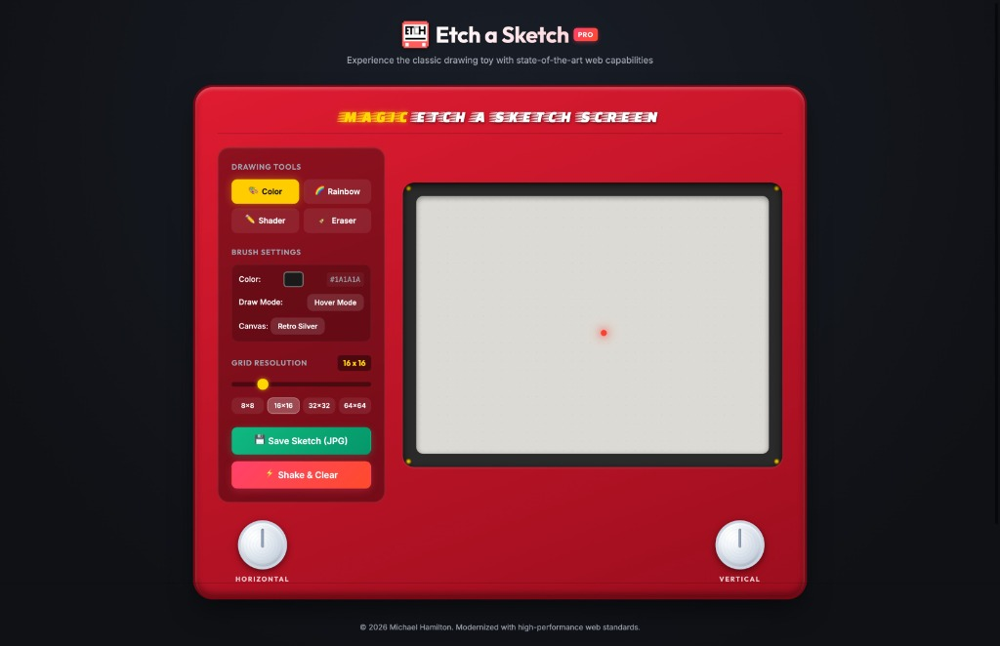

# Etch a Sketch | Modern Pro Edition

[](https://developer.mozilla.org/en-US/docs/Web/HTML)
[](https://developer.mozilla.org/en-US/docs/Web/CSS)
[](https://developer.mozilla.org/en-US/docs/Web/JavaScript)
[](https://opensource.org/licenses/MIT)

A premium, interactive, and high-performance web-based recreation of the classic mechanical drawing toy. Built from the ground up utilizing semantic HTML5, modern CSS3 (Custom Properties, Flexbox, Grid, Glassmorphism, Keyframes), and vanilla ES6+ JavaScript with strict accessibility (WCAG 2.1 AA) and performance optimizations.



## 🌟 Features

* **Classic & Modern Casing Aesthetic:** A beautiful ruby-red casing complete with glossy highlights, gold brand lettering, decorative metallic corner rivets, and interactive rotating control knobs.
* **4 Drawing Modes:**
  * 🎨 **Color:** Draw with a custom solid color selected via a native high-precision color picker.
  * 🌈 **Rainbow:** Draw with cycling random HSL colors for vibrant, colorful sketches.
  * ✏️ **Shader:** A progressive graphite pencil shading mode where each pass darkens the tile by 10% (from 10% to 100% opacity).
  * 🧹 **Eraser:** Selectively wipe out lines, returning tiles back to the default canvas background.
* **Dual Canvas Themes:** Toggle instantly between **Retro Silver** (classic metallic drawing screen) and **Neon Midnight** (cyberpunk dark mode with glowing cyan and neon lines).
* **Multi-Modal Interactive Controls:**
  * **Pointer & Touch Hover / Drag:** Toggle between classic **Hover Mode** (draws instantly as you move your pointer across the canvas) or **Click & Drag** (draws only when the pointer is pressed down).
  * **iPad & Tablet Multi-Touch Knobs:** Designed for tactile two-handed tablet play! Touch and twist the left/right mechanical knobs with your thumbs or fingers on an iPad or tablet screen; independent pointer tracking allows turning both knobs simultaneously without multi-touch interference or page scrolling, with adaptive gear ratio thresholds scaling across resolutions.
  * **Keyboard Navigation:** Draw seamlessly using keyboard Arrow Keys or `WASD` controls, which physically rotate the on-screen knobs and update ARIA values in real-time.
* **Dynamic Grid Size Resolution:** Select between standard resolutions (`8x8`, `16x16`, `32x32`, `64x64`) or use the slider for a custom grid resolution anywhere between `4x4` and `64x64`.
* **High Performance Engine:** Utilizes JavaScript **Event Delegation** (one event handler on the parent grid instead of thousands on individual tiles) and **DocumentFragments** for instant O(1) grid regeneration without reflow stutter.
* **Save Sketch to Disk:** Press the **Save Sketch (JPG)** button to render your masterpiece onto a high-resolution 1024x1024 HTML5 canvas—complete with theme backgrounds, grid patterns, neon glow effects, and a branding watermark—and instantly download it as a `.jpg` image to your local drive. The export engine runs synchronously within the active user gesture for sub-5ms performance and 100% compatibility with browser download and popup blockers across desktop, tablet, and mobile devices.
* **Shake to Erase:** Click the **Shake & Clear** button to watch the entire Etch a Sketch shake with physics-based CSS keyframes as it wipes the canvas clean.

## 🚀 Getting Started

Since this is a client-side vanilla web application, there are no compilers, dependencies, or local build processes required. 

### Prerequisites

You only need a modern web browser (Chrome, Firefox, Safari, Edge).

### Installation & Run

Because this project utilizes modern **Native ES6 Modules** (`<script type="module">`), browsers enforce strict CORS policies that prevent loading modules over simple `file://` protocols. To run the app locally, start a lightweight development server:

1. Clone the repository:
   ```bash
   git clone https://github.com/hamilto8/etch-a-sketch.git
   ```
2. Navigate into the project directory:
   ```bash
   cd etch-a-sketch
   ```
3. Start a local server (choose one):
   * **Python 3:** `python3 -m http.server 8000` (then open `http://localhost:8000`)
   * **VS Code:** Install and click **"Go Live"** with the *Live Server* extension.
   * **Node / npx:** `npx serve .`

## 📁 Repository Structure

```text
etch-a-sketch/
├── images/
│   ├── etch.ico         # Favicon icon
│   ├── etch.png         # Logo asset
│   └── screenshot.jpg   # Application preview screenshot
├── js/                  # Native ES6+ Modular Architecture
│   ├── dom.js           # DOM elements cache and initialization
│   ├── state.js         # Reactive global application state
│   ├── grid.js          # DocumentFragment rendering, styling, & event delegation
│   ├── knobs.js         # Tablet multi-touch knob rotation & keyboard navigation
│   ├── export.js        # Synchronous HTML5 canvas rendering & JPG export
│   ├── ui.js            # Control panel, themes, & drawing mode event handlers
│   └── main.js          # Application entry point & subsystem bootstrap
├── index.html           # Semantic HTML5 layout and accessible control structure
├── css/                 # Modular Component-Scoped Stylesheets
│   ├── variables.css    # Design tokens, colors, & typography
│   ├── base.css         # Reset, layout wrapper, aurora animation, & footer
│   ├── casing.css       # Ruby-red toy casing & grid layout
│   ├── controls.css     # UI cards, buttons, sliders, knobs, & shake animations
│   ├── screen.css       # Drawing canvas bezel, tiles, & cyberpunk neon theme
│   └── responsive.css   # Media queries for tablet, iPad, & mobile devices
├── LICENSE              # MIT Open Source License
└── README.md            # Project documentation (this file)
```

## 🛠️ Built With

* **Markup:** Strict Semantic [HTML5](https://developer.mozilla.org/en-US/docs/Web/HTML) with comprehensive WCAG 2.1 ARIA landmark and role tagging (`role="group"`, `role="slider"`, `aria-valuenow`).
* **Styling:** Vanilla CSS3 utilizing Custom Properties (`:root`), Flexbox, CSS Grid, Glassmorphism backdrop filters, overscroll behavior controls, and hardware-accelerated CSS animations.
* **Interactivity:** Vanilla [JavaScript (ES6+)](https://developer.mozilla.org/en-US/docs/Web/JavaScript) utilizing encapsulated state management, Event Delegation, Multi-Touch Pointer APIs (`pointerId` locking), synchronous HTML5 `<canvas>` rendering engine, and defensive pointer capture cleanup.

## 📄 License

This project is licensed under the MIT License - see the [LICENSE](file:///Users/michaelhamilton/Projects/github_projects/etch-a-sketch/LICENSE) file for details.

## 👤 Author

* **Michael Hamilton** - [hamilto8](https://github.com/hamilto8)
